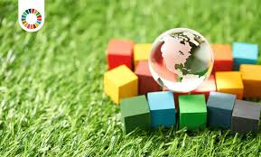

## 3.1. Estrategias personales para la sostenibilidad
Las estrategias personales para la sostenibilidad incluyen una serie de acciones que podemos llevar a cabo en nuestro día a día para reducir nuestra huella ecológica. Algunas de ellas son:
- **Reducción del consumo energético**: Utilizar dispositivos electrónicos de bajo consumo, apagar equipos cuando no se usen y optar por energías renovables.
- **Fomento del teletrabajo**: Disminuye la necesidad de desplazamientos diarios, reduciendo las emisiones de CO₂ y el consumo de combustibles fósiles.
- **Uso responsable de recursos digitales**: Reducir el almacenamiento innecesario en la nube, optimizar el uso de servidores y eliminar correos electrónicos innecesarios para disminuir la huella de carbono digital.

[Volver a Retos ambientales y sociales](./3_Retos_ambientales_y_sociales_alejandro.md) | [ir a Adopción de practicas sostenibles](./32_Adopción_de_practicas_sostenibles_alejandro.md)