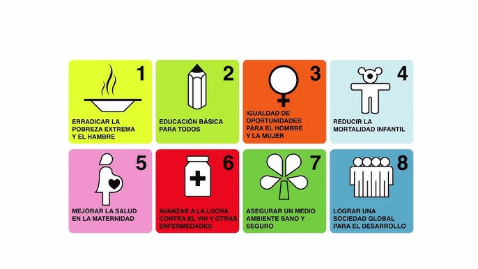

## 3.2. Adopción de prácticas sostenibles en el ámbito profesional
Las empresas y profesionales del sector tecnológico pueden implementar medidas sostenibles para minimizar su impacto ambiental:
- **Optimización de centros de datos**: Implementar servidores con eficiencia energética, usar energías renovables y optimizar la refrigeración.
- **Desarrollo de software sostenible**: Minimizar el consumo de recursos, mejorar la eficiencia del código y evitar la obsolescencia prematura.
- **Metodologías ágiles sostenibles**: Aplicar estrategias como DevOps verde, que busca minimizar el impacto ambiental en el desarrollo y operación de software.

[Volver a Retos ambientales y sociales](./3_Retos_ambientales_y_sociales_alejandro.md) | [ir a Estrategias personales ](./31_Estrategias_personales_alejandro.md)