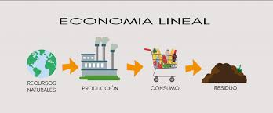

## 4.1. Caracterización del modelo lineal
El modelo económico tradicional sigue una estructura lineal que se basa en la explotación de recursos naturales y en un consumo acelerado sin planificación para la reutilización. Este sistema se compone de cuatro fases principales:  

Extracción de recursos naturales: 
Se extraen grandes cantidades de materias primas como petróleo, metales, minerales y madera.  
Este proceso causa deforestación, contaminación del agua y destrucción de ecosistemas.  

 
La fabricación industrial se centra en la producción en masa para satisfacer la demanda inmediata.  
La mayoría de los productos no están diseñados para ser reciclados o reutilizados, fomentando el desperdicio.  

Uso del producto hasta su desgaste o desactualización: 
Los consumidores utilizan los productos hasta que dejan de funcionar o se vuelven obsoletos.  
La obsolescencia programada y la falta de opciones de reparación aceleran el reemplazo de productos.  

Los productos terminan en vertederos o incineradoras sin procesos eficientes de reciclaje.  
Esto genera contaminación ambiental y un aumento exponencial en la cantidad de residuos electrónicos y plásticos.  

[Volver a Modelo de produccion y consumo actual](./4_Modelo_de_produccion_y_consumo_actual_alejandro.md) | [ir a Problematicas asociadas al modelo actual](./42_Problematicas_asociadas_al_modelo_actual_alejandro.md)