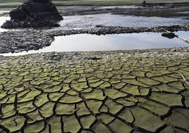

## 4.2. Problemáticas asociadas al modelo actual
El modelo lineal genera diversas problemáticas:
- **Agotamiento de recursos naturales**: El uso intensivo de materiales como el litio y el cobalto, esenciales para la tecnología, pone en riesgo su disponibilidad futura.
- **Generación de residuos electrónicos**: La obsolescencia programada y la falta de sistemas eficientes de reciclaje contribuyen a la acumulación de desechos electrónicos altamente contaminantes.
- **Sobreproducción y sobrecapacidad**: La fabricación excesiva de bienes sin estrategias de reutilización genera un desperdicio significativo de materiales y energía.

[Volver a Modelo de produccion y consumo actual](./4_Modelo_de_produccion_y_consumo_actual_alejandro.md) | [ir a Caracterización del modelo lineal](./41_Caracterizacion_del_modelo_lineal_alejandro.md)