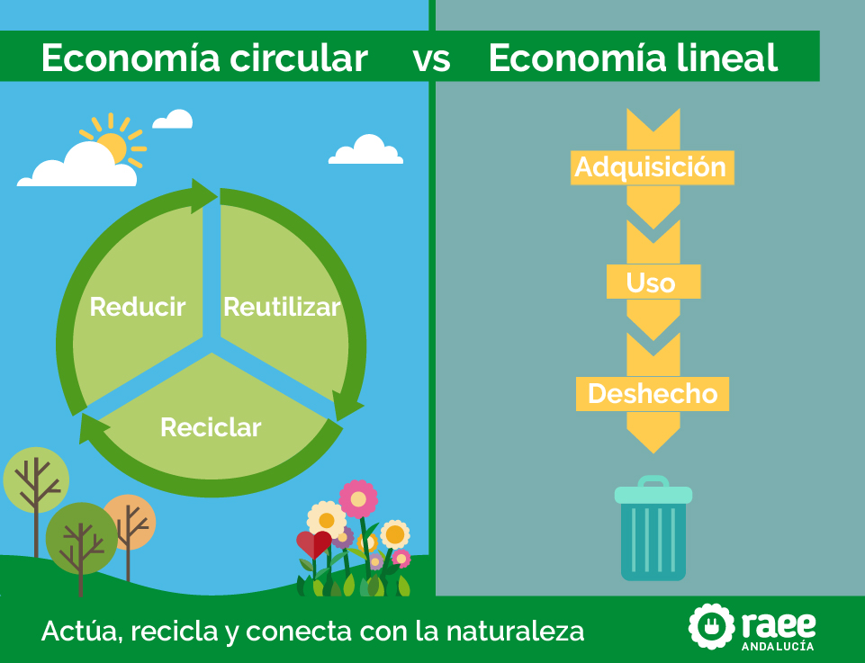

## 5.1 Economía lineal vs. Economía circular

**Economía lineal:** Se basa en un modelo tradicional de producción y consumo caracterizado por el proceso de "extraer, producir, usar y desechar". En este sistema, los recursos naturales se extraen para fabricar productos que, una vez utilizados, se convierten en residuos sin considerar su reutilización o reciclaje. Este enfoque ha sido dominante durante décadas debido a su simplicidad y a la falta de conciencia ambiental en los procesos industriales.  

 
**Economía** circular:Propone una alternativa sostenible basada en la reutilización, reparación, reciclaje y regeneración de productos y materiales. Su objetivo es minimizar la generación de residuos y maximizar el aprovechamiento de los recursos existentes, creando un ciclo continuo en el que los materiales mantienen su valor el mayor tiempo posible. Este modelo fomenta: Innovación en el diseño de productos, priorizando la durabilidad y facilidad de reciclaje. Prácticas sostenibles, como la logística inversa, el ecodiseño y la economía colaborativa. Reducción del impacto ambiental, disminuyendo la explotación de recursos y la acumulación de desechos.  
La economía circular no solo reduce el impacto ambiental.

[Volver a Principios de la economia verde y circular](./5_Principios_de_la_economia_verde_y_circular_alejandro.md) | [ir a Economia verde y azul frete al modelo clasico](./52_Economia_verde_y_azul_frente_al_modelo_clasico_alejandro.md)