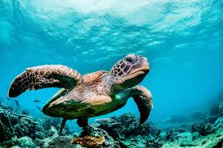

## 5.2 Economía verde y azul frente al modelo clásico

Economía verde: Se enfoca en reducir el impacto ambiental mediante la implementación de prácticas sostenibles, el uso de energías renovables y la optimización del consumo de recursos. Su propósito es lograr un equilibrio entre el crecimiento económico y la preservación del medioambiente, promoviendo actividades como eficiencia energética , movilidad sostenible y la reducción de emisiones contaminantes.

  

 
Economía azul: Inspirada en los ecosistemas naturales, busca replicar los procesos biológicos para aprovechar los recursos de manera eficiente y sostenible. A diferencia de la economía verde, que se centra en la reducción del impacto ambiental, la economía azul fomenta la reutilización de residuos y la transformación de desechos en nuevas materias primas, promoviendo un modelo de producción más circular. Se basa en principios como el aprovechamiento de subproductos industriales, la biomímesis y la regeneración de ecosistemas para generar un impacto positivo en el medioambiente

[Volver a Principios de la economia verde y circular](./5_Principios_de_la_economia_verde_y_circular_alejandro.md) | [ir a Economia lineal vs Economia circular](./51_Economia_lineal_vs_Economia_circular_alejandro.md)